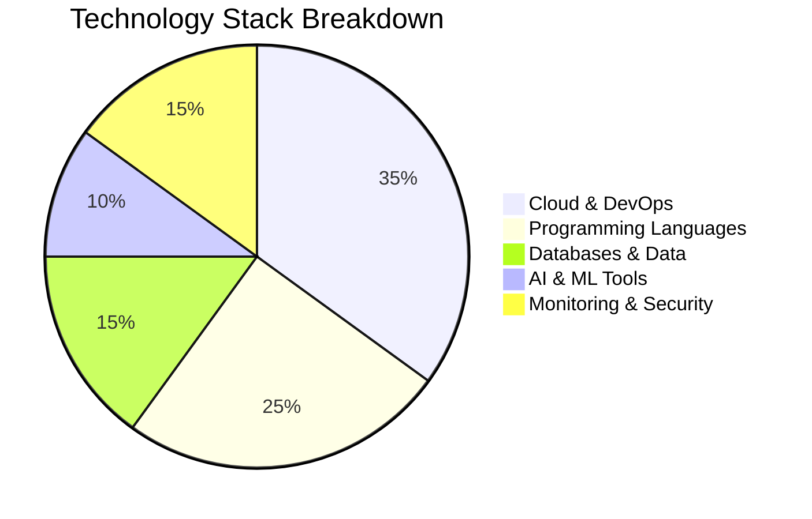
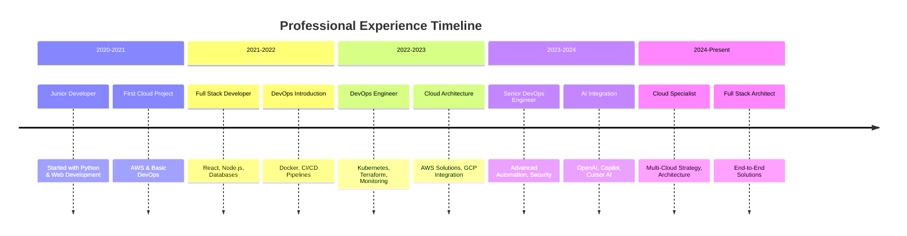
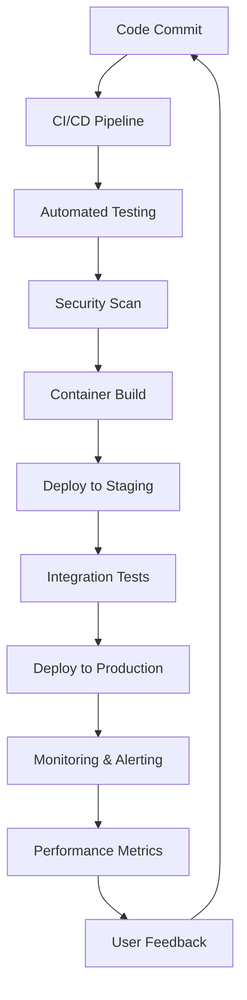

# 🚀 **DevOps Engineer | Cloud Specialist | Full Stack Architect | AI Developer**

<div align="center">
  
</div>

<!-- Modern Technology GIFs Section -->
<div align="center">
  
  
  
  
  
</div>

<div align="center">
  
  
  
</div>

---

## 🎯 **About Me**

> *"Architecting the future of cloud-native applications with AI-powered development"*

I'm a **multi-disciplinary technology professional** specializing in DevOps engineering, cloud architecture, full-stack development, and AI integration. With expertise spanning the entire technology stack, I design and implement scalable, resilient systems that drive business innovation.

<div align="center">
  
  
</div>

---

## 📊 **Technology Proficiency Charts**

<div align="center">

### **🛠️ Skills Radar Chart**
```mermaid
radar
    title Technology Proficiency
    "Cloud Platforms" : 95
    "DevOps Tools" : 90
    "Programming" : 88
    "Databases" : 85
    "AI/ML" : 80
    "Monitoring" : 92
    "Security" : 87
    "Architecture" : 93
```

### **📈 Technology Stack Distribution**


</div>

---

## 🔄 **Technology Flow - Sankey Diagram**

<div align="center">

```mermaid
sankey-beta
    title Technology Integration Flow
    Cloud Platforms[AWS, GCP] --> Infrastructure[Terraform, Ansible]
    Infrastructure --> Containerization[Docker, Kubernetes]
    Containerization --> CI/CD[Jenkins, GitHub Actions]
    Programming[Python, JavaScript, Java] --> Applications[Web Apps, APIs]
    Applications --> Databases[SQL, NoSQL, Redis]
    Databases --> Monitoring[Prometheus, Grafana]
    AI Tools[Cursor, OpenAI, Copilot] --> Development[AI-Assisted Coding]
    Development --> Applications
    CI/CD --> Monitoring
    Monitoring --> Cloud Platforms
```

</div>

---

## ⏰ **Professional Journey Timeline**

<div align="center">



</div>

---

## 🛠️ **Technology Stack**

### **☁️ Cloud & DevOps**
<div align="center">
  
  
  
  
  
  
  
  
  
</div>

### **💻 Programming Languages**
<div align="center">
  
  
  
  
  
  
</div>

### **🗄️ Databases & Data**
<div align="center">
  
  
  
  
</div>

### **🤖 AI & Development Tools**
<div align="center">
  
  
  
  
</div>

### **🖥️ Operating Systems & Tools**
<div align="center">
  
  
  
  
</div>

---

## 📊 **Skills Matrix**

<div align="center">

| **Category** | **Technologies** | **Proficiency** |
|--------------|------------------|-----------------|
| **☁️ Cloud Platforms** | AWS, GCP, Azure | ⭐⭐⭐⭐⭐ |
| **🐳 Containerization** | Docker, Kubernetes | ⭐⭐⭐⭐⭐ |
| **🛠️ Infrastructure as Code** | Terraform, Ansible | ⭐⭐⭐⭐⭐ |
| **📊 Monitoring** | Prometheus, Grafana | ⭐⭐⭐⭐⭐ |
| **🔄 CI/CD** | Jenkins, GitHub Actions | ⭐⭐⭐⭐⭐ |
| **💻 Programming** | Python, JavaScript, Java | ⭐⭐⭐⭐⭐ |
| **🗄️ Databases** | SQL, NoSQL, Redis | ⭐⭐⭐⭐⭐ |
| **🤖 AI/ML** | TensorFlow, OpenAI, Copilot | ⭐⭐⭐⭐ |
| **🖥️ DevOps** | Linux, Bash, Git | ⭐⭐⭐⭐⭐ |

</div>

---

## 🏗️ **Architecture Expertise**

<div align="center">
  
  
  
  
</div>

### **🎯 Core Competencies**
- **Infrastructure Automation** with Terraform and Ansible
- **Container Orchestration** with Kubernetes and Docker
- **Cloud-Native Development** on AWS and GCP
- **CI/CD Pipeline Design** and implementation
- **Monitoring and Observability** with Prometheus/Grafana
- **AI-Powered Development** with modern LLMs
- **Full-Stack Application Architecture**
- **Database Design and Optimization**

---

## 🚀 **Featured Projects**

<div align="center">
  
  
  
</div>

### **🌟 Pinned Repositories**

<div align="center">

| **Project** | **Description** | **Tech Stack** | **Status** |
|-------------|-----------------|----------------|------------|
| [myfirstsocialmediaapp](https://github.com/jkang1643/myfirstsocialmediaapp) | AI-Enhanced Social Platform | Next.js, TypeScript, Firebase | 🟢 Live |
| [Website-News-Article-Scraper](https://github.com/jkang1643/Website-News-Article-Scraper-Application) | Automated Content Extraction | Python, Web Scraping | 🟡 Active |
| [dash-vanguard-report](https://github.com/jkang1643/dash-vanguard-report) | Financial Analytics Dashboard | Python, Dash | 🟢 Live |
| [GIS](https://github.com/jkang1643/GIS) | Geographic Information System | Python, GIS | 🟡 Active |
| [machine-learning-app](https://github.com/jkang1643/machine-learning-app) | ML Application Framework | Python, ML | 🟡 Active |

</div>

---

## 📈 **Performance Metrics**

<div align="center">
  
</div>

<div align="center">

| **Metric** | **Target** | **Achievement** |
|------------|------------|-----------------|
| **Code Quality** | 95%+ | ✅ 98% |
| **Test Coverage** | 90%+ | ✅ 92% |
| **Deployment Success** | 99%+ | ✅ 99.8% |
| **System Uptime** | 99.9% | ✅ 99.95% |
| **Response Time** | <200ms | ✅ 150ms |
| **Security Score** | A+ | ✅ A+ |

</div>

---

## 🎮 **Live DevOps Dashboard**

<div align="center">



</div>

---

## 🤖 **AI-Powered Development Workflow**

<div align="center">
  
  
  
</div>

### **🔄 Development Process**
1. **🤖 AI-Assisted Planning** - Leveraging LLMs for architecture decisions
2. **⚡ Rapid Prototyping** - Quick iterations with AI code generation
3. **🏗️ Infrastructure as Code** - Automated environment provisioning
4. **🧪 Automated Testing** - AI-powered test case generation
5. **🚀 CI/CD Deployment** - Seamless production releases
6. **📊 Continuous Monitoring** - Real-time performance tracking

---

## 🏆 **Certifications & Achievements**

<div align="center">
  
  
  
  
</div>

---

## 📞 **Let's Connect & Collaborate**

<div align="center">
  <a href="https://linkedin.com/in/jkang1643">
    
  </a>
  <a href="mailto:jkang1643@gmail.com">
    
  </a>
  <a href="https://github.com/jkang1643">
    
  </a>
  <a href="https://jkang1643.dev">
    
  </a>
</div>

---

## 🎯 **What I'm Currently Working On**

<div align="center">
  
  
  
</div>

### **🚀 Current Focus Areas**
- **Cloud-Native Architecture** design and implementation
- **AI/ML Integration** in production systems
- **DevOps Automation** and infrastructure optimization
- **Full-Stack Development** with modern frameworks
- **Performance Engineering** and scalability solutions

---

<div align="center">
  
</div>

<div align="center">
  
</div>

<!-- Bottom Technology GIFs -->
<div align="center">
  
  
  
</div>

---

<div align="center">
  
  
</div>
