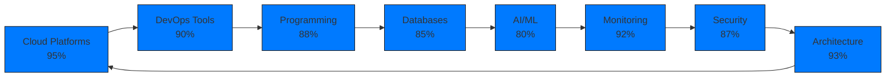
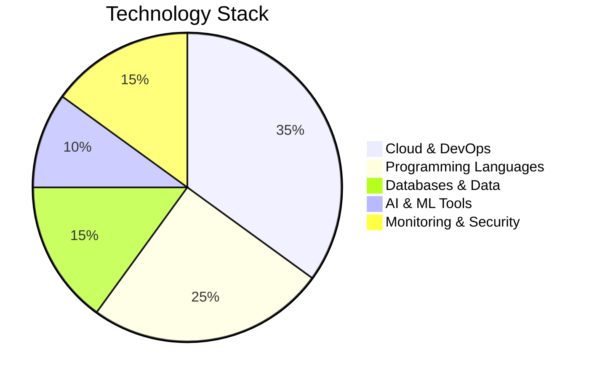
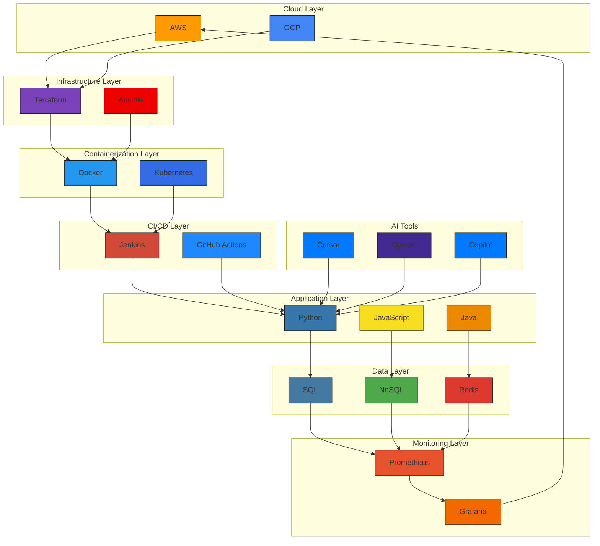
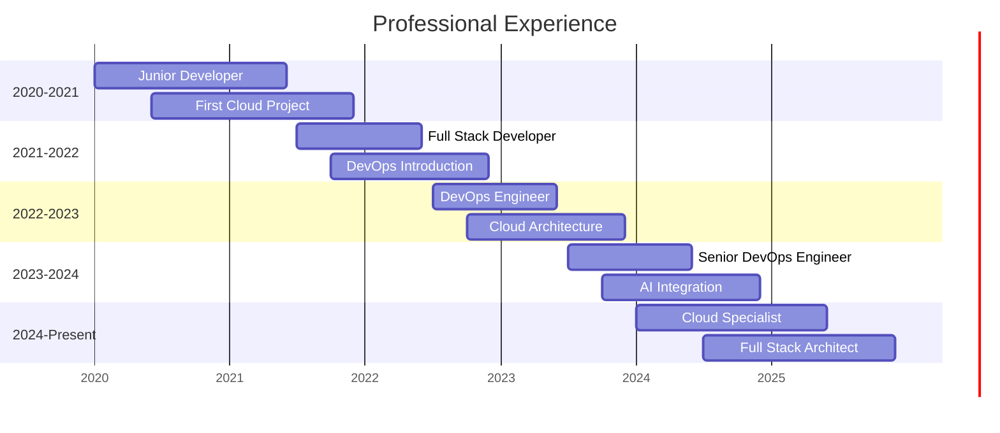
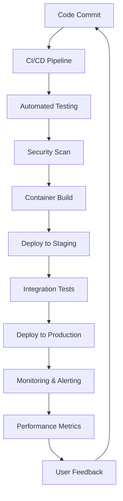

# **DevOps Engineer | Cloud Specialist | Full Stack Architect | AI Developer**

  

<!-- Modern Technology GIFs Section -->

  
  
  
  
  

  
  
  

---

## **About**

> *"Architecting the future of cloud-native applications with AI-powered development"*

I'm a multi-disciplinary technology professional specializing in DevOps engineering, cloud architecture, full-stack development, and AI integration. With expertise spanning the entire technology stack, I design and implement scalable, resilient systems that drive business innovation.

  
  

---

## **Technology Proficiency**

### **Skills Overview**

### **Technology Distribution**

---

## **Technology Integration**

---

## **Professional Journey**

---

## **Technology Stack**

### **Cloud & DevOps**

  
  
  
  
  
  
  
  
  

### **Programming Languages**

  
  
  
  
  
  

### **Databases & Data**

  
  
  
  

### **AI & Development Tools**

  
  
  
  

### **Operating Systems & Tools**

  
  
  
  

---

## **Skills Matrix**

| **Category** | **Technologies** | **Proficiency** |
|--------------|------------------|-----------------|
| **Cloud Platforms** | AWS, GCP, Azure | ⭐⭐⭐⭐⭐ |
| **Containerization** | Docker, Kubernetes | ⭐⭐⭐⭐⭐ |
| **Infrastructure as Code** | Terraform, Ansible | ⭐⭐⭐⭐⭐ |
| **Monitoring** | Prometheus, Grafana | ⭐⭐⭐⭐⭐ |
| **CI/CD** | Jenkins, GitHub Actions | ⭐⭐⭐⭐⭐ |
| **Programming** | Python, JavaScript, Java | ⭐⭐⭐⭐⭐ |
| **Databases** | SQL, NoSQL, Redis | ⭐⭐⭐⭐⭐ |
| **AI/ML** | TensorFlow, OpenAI, Copilot | ⭐⭐⭐⭐ |
| **DevOps** | Linux, Bash, Git | ⭐⭐⭐⭐⭐ |

---

## **Architecture Expertise**

  
  
  
  

### **Core Competencies**
- Infrastructure Automation with Terraform and Ansible
- Container Orchestration with Kubernetes and Docker
- Cloud-Native Development on AWS and GCP
- CI/CD Pipeline Design and implementation
- Monitoring and Observability with Prometheus/Grafana
- AI-Powered Development with modern LLMs
- Full-Stack Application Architecture
- Database Design and Optimization

---

## **Featured Projects**

  
  
  

### **Pinned Repositories**

| **Project** | **Description** | **Tech Stack** | **Status** |
|-------------|-----------------|----------------|------------|
| [myfirstsocialmediaapp](https://github.com/jkang1643/myfirstsocialmediaapp) | AI-Enhanced Social Platform | Next.js, TypeScript, Firebase | 🟢 Live |
| [Website-News-Article-Scraper](https://github.com/jkang1643/Website-News-Article-Scraper-Application) | Automated Content Extraction | Python, Web Scraping | 🟡 Active |
| [dash-vanguard-report](https://github.com/jkang1643/dash-vanguard-report) | Financial Analytics Dashboard | Python, Dash | 🟢 Live |
| [GIS](https://github.com/jkang1643/GIS) | Geographic Information System | Python, GIS | 🟡 Active |
| [machine-learning-app](https://github.com/jkang1643/machine-learning-app) | ML Application Framework | Python, ML | 🟡 Active |

---

## **Performance Metrics**

  

| **Metric** | **Target** | **Achievement** |
|------------|------------|-----------------|
| **Code Quality** | 95%+ | ✅ 98% |
| **Test Coverage** | 90%+ | ✅ 92% |
| **Deployment Success** | 99%+ | ✅ 99.8% |
| **System Uptime** | 99.9% | ✅ 99.95% |
| **Response Time** | <200ms | ✅ 150ms |
| **Security Score** | A+ | ✅ A+ |

---

## **DevOps Workflow**

---

## **AI-Powered Development**

  
  
  

### **Development Process**
1. **AI-Assisted Planning** - Leveraging LLMs for architecture decisions
2. **Rapid Prototyping** - Quick iterations with AI code generation
3. **Infrastructure as Code** - Automated environment provisioning
4. **Automated Testing** - AI-powered test case generation
5. **CI/CD Deployment** - Seamless production releases
6. **Continuous Monitoring** - Real-time performance tracking

---

## **Certifications & Achievements**

  
  
  
  

---

## **Connect & Collaborate**

  
  
  
  

---

## **Current Focus**

  
  
  

### **Focus Areas**
- Cloud-Native Architecture design and implementation
- AI/ML Integration in production systems
- DevOps Automation and infrastructure optimization
- Full-Stack Development with modern frameworks
- Performance Engineering and scalability solutions

---

  

  

<!-- Bottom Technology GIFs -->

  
  
  

---

  
  

